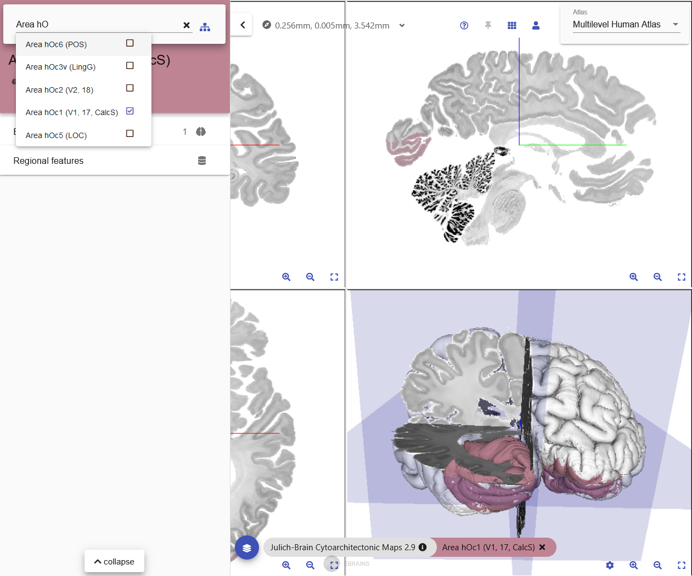

# Selecting

## Selecting a template / atlas

The *siibra-explorer* supports a number of atlases.

### From homepage

Clicking on the respective atlas species will lead to the atlas of the selected species.

### From viewer

Once you select an atlas, the list of available templates and parcellations can be accessed from the layer selector (blue button at the bottom left).

### Information on the selected template / parcellation

Information on the selected template or parcellation can be revealed by `clicking` the `info` button.

## Selecting and browsing regions

There exist several ways of selecting and browsing the parcellated regions in a given parcellation in the *siibra-explorer*.

### Directly from the parcellation map

Each of the regions is represented as a coloured segment in _slice views_ (and in most circumstances, in _3D view_ as well). Click on the segment to select the brain region.

### Using the quick search box

Search for regions of interest by using the region search box.

### Using the taxonomy feature

To view the full hierarchy of region names and relationships between brain regions, `click` the taxonomy button. 

### Explore the region in other reference templates
If the parcellation region is available in multiple reference spaces, it is possible to explore them directly from the left quick search menu.

Select a region as described above and open `Explore in other templates` in the left quick search menu. If the region is available in multiple reference spaces, they are displayed here. Then, choose the reference space in which you want to explore the region.

More information about the selected regions of interest can be retrieved and displayed using the quick search menu, such as descriptions and semantically linked datasets. More detailed information is available in [Searching](search.md).

## Selecting / Deselecting region(s)

### From the viewer

`click` on a region (coloured segment) to bring up a context specific menu.

From here, `click` on `[] Selected` checkbox will select or deselect the region.

### From the quick search box

`click` on the name or the checkbox will select or deselect the region.

### From the hierarchical tree

`click` on any _region_ or _parent region_ will (mass) select / deselect the region(s). 

